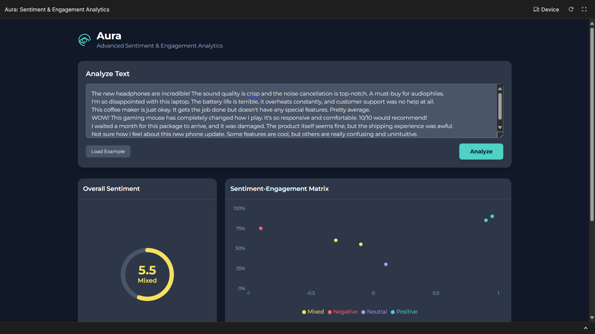
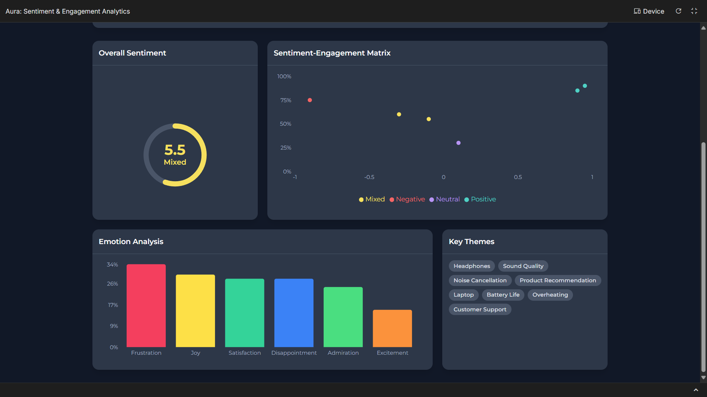

# Aura

Aura is a web application that delivers deep sentiment analysis for social media posts and product reviews. It converts textual feedback into clear, insightful data (sentiment scores, trends, etc.), so you can better understand what people are really saying.

---

## 📸 Screenshot

Here's a preview of the app in action:




---

## ✨ Features

- Processes both single texts (e.g. one review) and batches (e.g. many posts)  
- Visualize overall sentiment, positive vs negative vs neutral breakdowns  
- Supports multiple platforms / input sources  
- Clean UI to see what matters: tone, common keywords, possibly trends over time  

---

## 🛠️ Tech Stack

- **TypeScript** – for type safety and maintainability  
- **React / Vite** – fast front-end framework + bundling tool  
- **HTML / CSS** – UI structure & styling  
- Possibly using external APIs / services for sentiment analysis  
- Environment variables (e.g. for API keys) stored in `.env.local`  

---

## 🚀 Quick Start (Run Locally)

# Run and deploy your AI Studio app

This contains everything you need to run your app locally.

View your app in AI Studio: https://ai.studio/apps/drive/1ukeEbXmz95GC0NMCzodg26AxQcVrA_VC

Clone the repo  
   ```bash
   git clone https://github.com/tech-savvy1/Aura.git
   cd Aura
